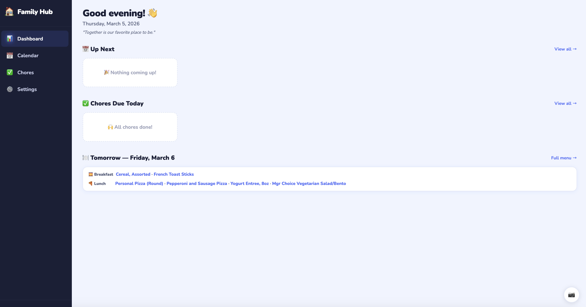
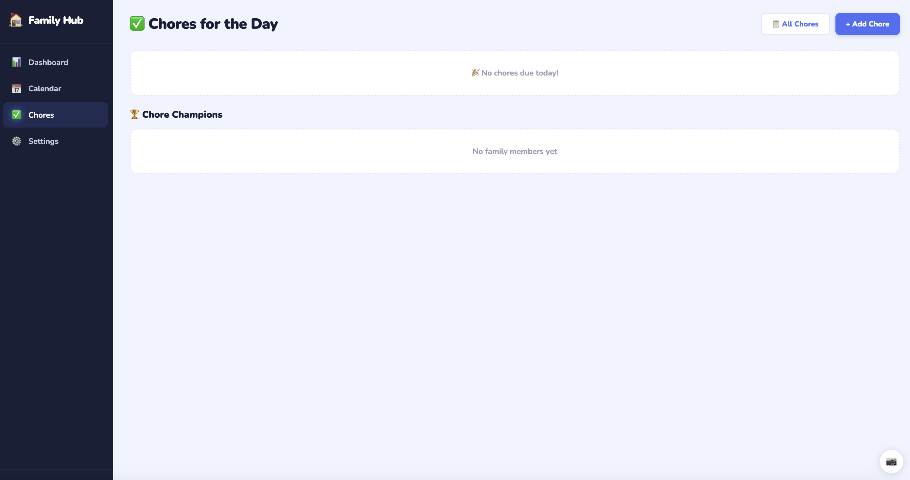

# Family Hub

A self-hosted family dashboard built for a wall-mounted touchscreen. Combines calendar, chores, messages, security cameras, weather, Home Assistant integration, and more — all in one polished interface your whole family can use.

## Screenshots

| Dashboard | Chores |
|-----------|--------|
|  |  |

| Messages | Security |
|----------|----------|
|  |  |

---

## Features

### Dashboard
- Greeting with time of day, date, and rotating family quote
- **Up Next** — upcoming calendar events
- **Chores Today** — today's chore assignments; shows streak leaderboard when all done
- **Lunch Menu** — school lunch pulled from Nutrislice (BCPS and others); shows tomorrow after 5 PM
- **Message preview pill** — latest family note displayed above the grid; ✏️ button to post directly without leaving the dashboard
- Live Home Assistant status badges (garage, alarm) in the header
- Weather widget — current conditions + tomorrow's forecast (high/low + precipitation %)
- Stock ticker (slim banner, configurable symbols)
- Auto-refreshes every 5 minutes

### Family Messages Board
- Leave quick notes for the family (e.g. "I'm at practice, home by 6")
- Color-coded per person with avatar
- Unread badge on the nav link — clears when you visit the page
- Quick-compose from the dashboard without navigating away
- Messages auto-expire after 7 days

### Calendar
- Month view with color-coded event dots per family member
- **Tap any event** to see a detail popover — title, time, location (tappable → Google Maps), description, person tag, delete button
- Tap a day to see all events in a side panel
- Google Calendar sync — shared family calendar + per-member calendars
- Location field synced from Google Calendar automatically
- Add events directly with optional location and Google Calendar targeting

### Chores
- Daily chore assignments per family member with morning/afternoon/evening grouping
- Points system with Chore Champions leaderboard
- **Day streaks** — consecutive days of completed chores, shown on dashboard
- Recurring chores (daily, weekly, custom days)
- Color-coded cards with each person's color

### Security
- **Camera feeds** — live MJPEG streams via Home Assistant proxy (no go2rtc required)
- Fullscreen camera modal with prev/next arrows, dot indicators, keyboard arrow keys, and swipe gestures
- **Garage doors** — open/close control with live state
- **Alarm panel** — arm home, arm away, disarm with optional PIN

### Night Mode & Auto-Dim (wall-mount friendly)
- **Dark mode** — automatically switches after sunset (default 9 PM–7 AM)
- **Auto-dim** — screen goes nearly black after inactivity (default 5 min); any touch restores it
- Both configurable in Settings → General → Night Mode

### PWA — Install on Tablet
The app ships with a Web App Manifest so you can install it to your tablet's home screen:
- On iPad/iPhone: Safari → Share → Add to Home Screen
- On Android: Chrome → ⋮ → Add to Home Screen / Install App

Launches full-screen in landscape with no browser chrome.

### Settings
Organized into 4 tabs:
- **Family** — members (name, color, avatar) + Google Calendar connection
- **Home** — Home Assistant URL/token/entities + camera feeds
- **Integrations** — Weather zip, lunch school, stock symbols, slideshow
- **General** — Timezone + Night Mode (dark hours + auto-dim timeout)

---

## Quick Start

### 1. Create your `.env` file

```bash
cp .env.example .env
nano .env
```

**.env contents:**

```env
# The public URL where Family Hub is accessible (used for Google OAuth redirects)
APP_BASE_URL=http://192.168.1.100:3000

# Google OAuth credentials (see "Set up Google OAuth" below)
GOOGLE_CLIENT_ID=your_client_id_here
GOOGLE_CLIENT_SECRET=your_client_secret_here
```

> **Important:** The `.env` file is gitignored and will never be committed.

---

### 2. Set up Google OAuth (one-time, optional)

Required only for Google Calendar sync.

1. Go to [https://console.cloud.google.com](https://console.cloud.google.com)
2. Create a project → enable the **Google Calendar API**
3. Create **OAuth 2.0 Client ID** credentials (Web application type)
4. Add these **Authorized redirect URIs** (replace with your `APP_BASE_URL`):
   ```
   http://192.168.1.100:3000/api/auth/google/callback/family
   http://192.168.1.100:3000/api/auth/google/callback/member
   ```
5. Copy the Client ID and Secret into your `.env`

---

### 3. Build and run

```bash
docker compose up -d --build
```

### 4. Open the app

Navigate to `http://your-server-ip:3000`

---

## First-Time Setup (In-App Settings)

### Family Members
Add each person — name, color, avatar emoji. They appear in the sidebar and can be assigned to chores and calendars.

### Home Assistant
1. **HA URL** — e.g. `http://192.168.1.100:8123`
2. **Long-Lived Access Token** — Home Assistant → Profile → Security → Long-Lived Access Tokens
3. **Entities** — add entity IDs to monitor:
   - `cover.garage_door` — garage door
   - `alarm_control_panel.home` — alarm panel
4. **Cameras** — add HA camera entity IDs (e.g. `camera.driveway`) for live feeds on the Security page

### Night Mode
In **Settings → General → Night Mode**:
- Set dark mode start/end hours (default 9 PM – 7 AM)
- Set auto-dim timeout (default 5 minutes of inactivity)

### Timezone
Select your local timezone — affects all date/time displays and the lunch menu.

### Weather
Enter your US zip code for current conditions and tomorrow's forecast on the dashboard.

### Google Calendar
- Connect a shared family Google account for the main calendar
- Choose which Google Calendars to sync
- New events created in Family Hub are added to your selected calendar
- Event locations sync automatically from Google Calendar

### School Lunch Menu
Enter your Nutrislice school domain (e.g. `bcps`) in Settings → Integrations → Lunch.

### Photo Slideshow
- Upload photos (JPG, PNG, GIF, WebP)
- Set inactivity timeout and photo interval
- Click the 📷 button (bottom-right) to start manually

---

## Updating

```bash
git pull
docker compose up -d --build
```

---

## Data & Backups

All data is stored in `./data/familyhub.db` (SQLite). Back this file up regularly.

Uploaded slideshow photos are stored in `./data/photos/`.

---

## Ports

Runs on port `3000` by default. Change the left side of `"3000:3000"` in `docker-compose.yaml` to use a different port.
