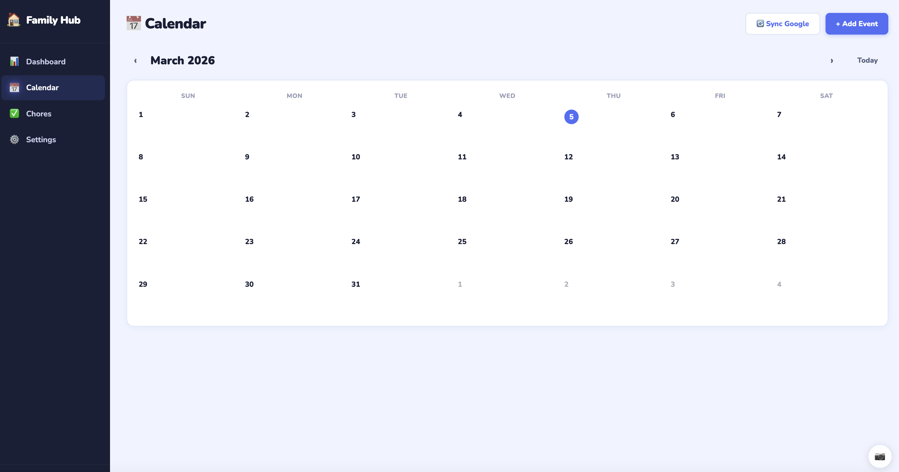
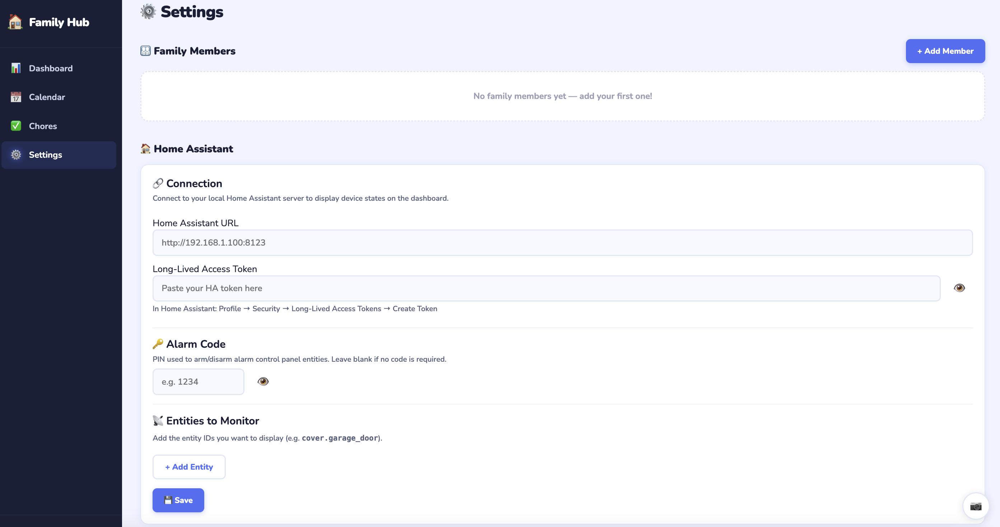

# Family Hub

A self-hosted family dashboard with calendar, chores, weather, Home Assistant integration, and photo slideshow.

## Screenshots

| Dashboard | Calendar |
|-----------|----------|
|  |  |

| Chores | Settings |
|--------|----------|
|  |  |

---

## Features

- Dashboard with today's events, chores due, weather, and home device status
- Family calendar with month view and Google Calendar sync
- Chore tracker with assignments, due dates, recurrence, points, and leaderboard
- Home Assistant integration — display garage doors, locks, sensors, and more
- School lunch menu (BCPS / Nutrislice)
- Photo slideshow screensaver
- Touch-friendly — works great on iPad, Chromebook, or any browser

---

## Quick Start

### 1. Create your `.env` file

Copy the example and fill in your values:

```bash
cp .env.example .env
nano .env
```

**.env contents:**

```env
# The public URL where Family Hub is accessible (used for Google OAuth redirects)
# Use your local IP for local-only access, or your Nabu Casa / ngrok URL for remote access
APP_BASE_URL=http://192.168.1.100:3000

# Google OAuth credentials (see "Set up Google OAuth" below)
GOOGLE_CLIENT_ID=your_client_id_here
GOOGLE_CLIENT_SECRET=your_client_secret_here
```

> **Important:** The `.env` file is gitignored and will never be committed. Keep it safe — it contains your Google OAuth secret.

---

### 2. Set up Google OAuth (one-time)

Required for Google Calendar sync. Skip if you don't need calendar sync.

1. Go to [https://console.cloud.google.com](https://console.cloud.google.com)
2. Create a new project (or select an existing one)
3. Go to **APIs & Services → Library** → search for **Google Calendar API** → Enable it
4. Go to **APIs & Services → Credentials** → **Create Credentials → OAuth 2.0 Client ID**
5. Application type: **Web application**
6. Add these **Authorized redirect URIs** (replace with your `APP_BASE_URL`):
   ```
   http://192.168.1.100:3000/api/auth/google/callback/family
   http://192.168.1.100:3000/api/auth/google/callback/member
   ```
7. Copy the **Client ID** and **Client Secret** into your `.env` file

---

### 3. Build and run

```bash
docker compose up -d --build
```

### 4. Open the app

Navigate to `http://your-ubuntu-ip:3000` (local) or your `APP_BASE_URL` (remote).

---

## First-Time Setup (In-App Settings)

After the app is running, go to **Settings** and configure each section:

### Family Members
Add each person in your household. Each member gets a name, color, and avatar emoji. Members appear in the sidebar and can be assigned to chores and calendars.

### Home Assistant
Connect to your local Home Assistant server to display device states on the dashboard (garage doors, locks, sensors, etc.).

1. **Home Assistant URL** — the local address of your HA server, e.g. `http://192.168.1.100:8123`
2. **Long-Lived Access Token** — in Home Assistant: *Profile → Security → Long-Lived Access Tokens → Create Token*
3. **Entities to Monitor** — add entity IDs you want displayed, e.g.:
   - `cover.garage_door` — garage door (open/closed)
   - `binary_sensor.front_door` — door/window sensor
   - `alarm_control_panel.home` — alarm panel
4. **Alarm Code** — optional PIN used to arm/disarm alarm panel entities
5. Click **Save** — devices appear on the dashboard and refresh every 30 seconds

### Timezone
Select your local timezone. This affects all date/time displays throughout the app and the school lunch menu.

### Weather
Enter your US zip code to show current weather conditions on the dashboard.

### Google Calendar
- **Shared Family Calendar** — connect one Google account as the main family calendar. All events from this account appear on the dashboard and calendar page.
- **Write new events to** — choose which Google Calendar new events created in Family Hub get added to.
- After connecting, use the calendar picker to select which of your Google Calendars to sync.

### Photo Slideshow
- Upload photos (JPG, PNG, GIF, WebP) to display as a screensaver
- **Inactivity timeout** — how long before the slideshow starts (default: 2 minutes)
- **Photo interval** — how long each photo is displayed (default: 5 seconds)
- Click the camera button (bottom-right corner of any page) to start the slideshow manually

---

## Updating

```bash
git pull
docker compose up -d --build
```

---

## Data & Backups

All data is stored in `./data/familyhub.db` (SQLite). Back up this file regularly to preserve your family members, chores, events, and settings.

Uploaded slideshow photos are stored in `./data/photos/`.

---

## Ports

The app runs on port `3000`. To change it, edit the left side of `"3000:3000"` in `docker-compose.yaml`.
